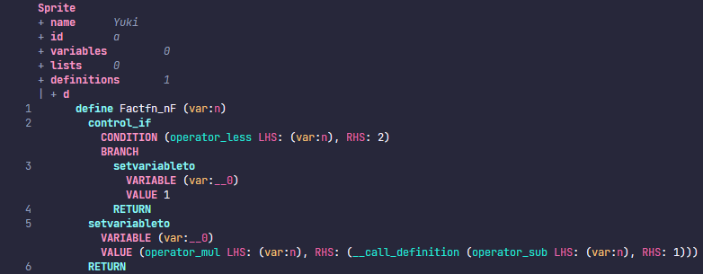

# the Yak Programming Language

> warning: this project is still on working

Yak projects can be compiled into a Scratch(.sb3) file.

# Docs

1. ## Compiler - RIP

2. ## Yak Guide

   Yak's syntax is like Python, but it only allows definitions in the top-level
   scope. Here is an example of a yak source file:

   ```python
   def Fact(n) -> num:
       if n < 2:
           return 1
       return n * Fact(n - 1)
   ```

   It looks like Python, isn't it? Okay, let's get Yaking.

   ### Identifiers

   Identifiers can include letters, the underscore(`_`) and numbers and
   identifiers cannot start with a number.

   Yak has some keywords that cannot be used as an identifier. Here are these
   keywords:

   ```plaintext
   def struct use for in while if elif else return unit  num str bool list nil _
   ```

   Yak has another identifier that can include any charactors you want, they
   start with a `r#` and end with a `#`.

   Identifier can be connect into a new identifier using `::`. Here are some
   examples:

   ```plaintext
   abc r#+# r#def# abc::def::r#return#
   ```

   ### Fucntions

   Functions start with a `def` keyword, an identifier, an optional generics
   list, an argument list, an optional return type, a colon(`:`) and a function
   body. A empty body must include a `...`.

   > warning: a function with generic types or struct types cannot be compiled
   > into a vaild Scratch project

   ```python
   def Func1():
       ...
    
   def Func2<T, U>(a: T, b: num, c, d: U) -> num:
       ...
   ```

   Yak's compiler will try to infer the type of identifiers with no type hint
   and produce an error if the compiler fails to infer.

   ### Structs

   Structs start with a `struct` keyword, an identifier, an optional generics
   list, a colon(`:`) and a struct body. Empty structs are not allowed.

   ```rust
   struct Pair<T, U>:
       _0: T
       _1: U
   ```

   ### Call a function with generics

   If you want to call a function with generics, you need to use `::<>` after
   the function name to specify the function's type. Here's an Example:

   ```python
   def Eq<T>(lhs: T, rhs: T):
       return lhs == rhs

   def Test(x: num, y: num):
       return Eq::<num>(x, y)
   ```

   ### Globals

   An identifier starts with a uppercase letter will be exported to the global
   scope.

3. ## How does yak work?

   > warning: this session is still on working

   First, yak's compiler spilts the source file into tokens and parses them into
   an AST(Abstract Syntax Tree) object. Second, scan the AST and bind all
   identifiers to its definition. Third, infer the type of any identifiers and
   expressions. Fourth, translate the AST into a lower Scratch IR and emits a
   vaild json of some Scratch blocks.

   An example of lower Scratch IR translation:

   ```python
   def Fact(n):
       if n < 2:
           return 1
       return n * Fact(n - 1)
   ```

   the lower Scratch IR:

   
